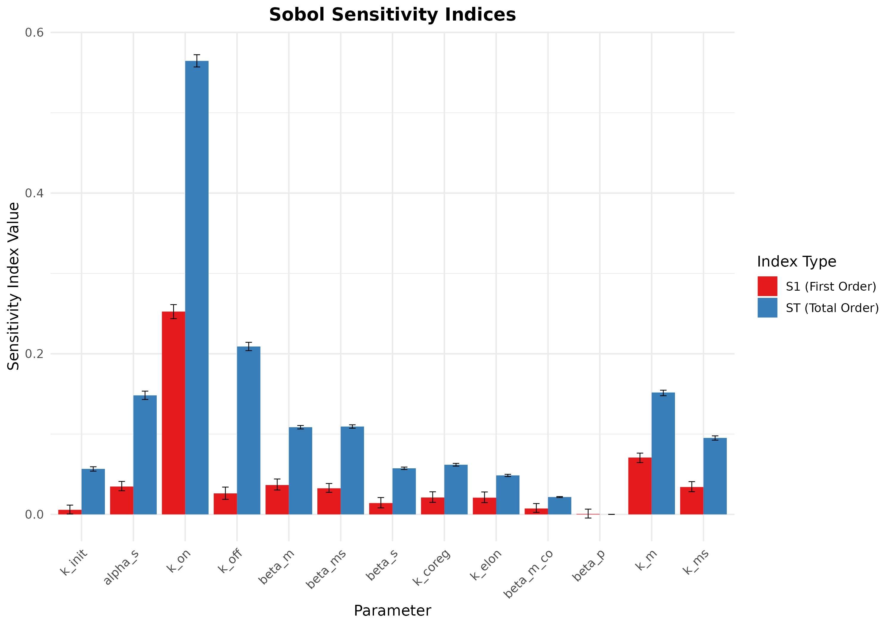
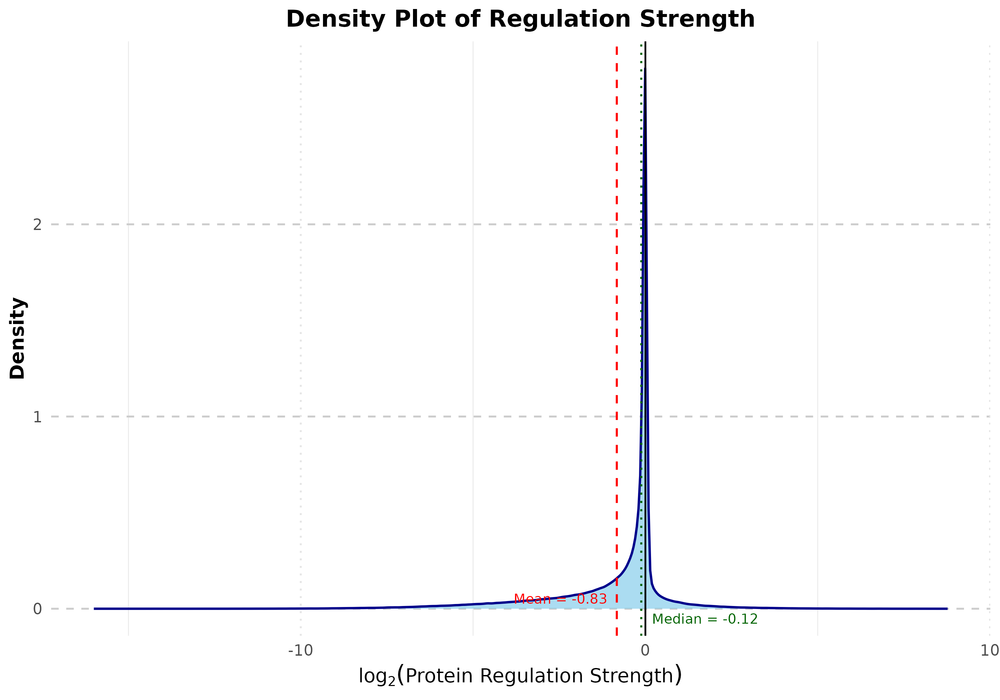
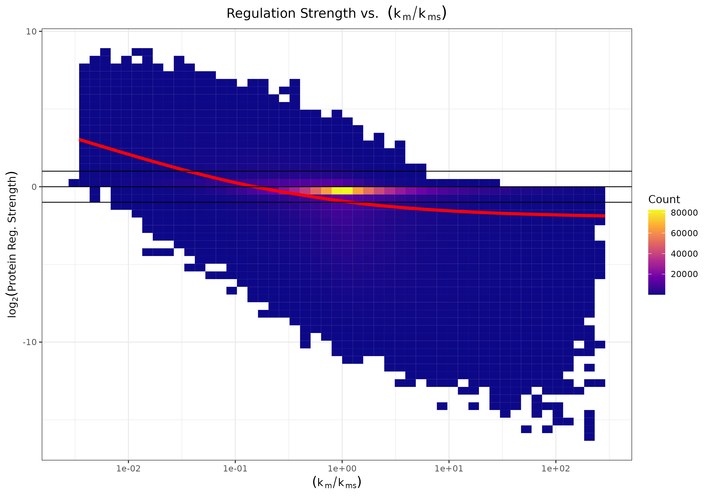
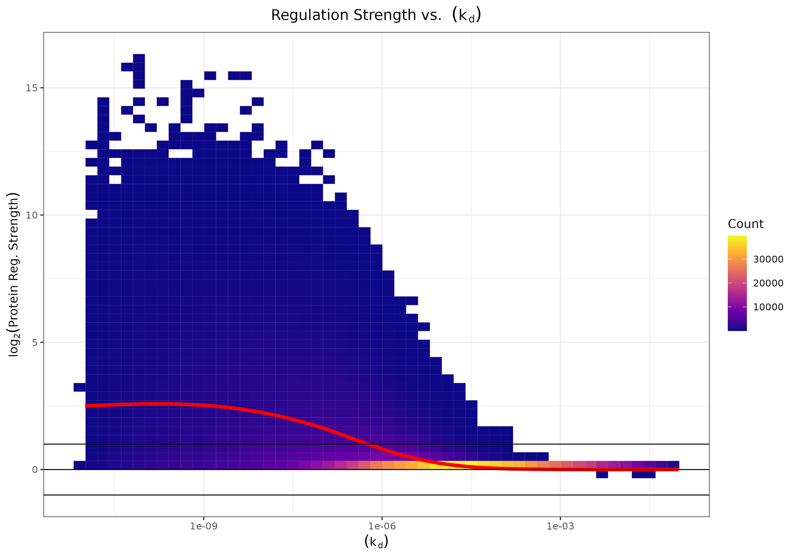

# Global Sensitivity Analysis of an ODE Model for sRNA-RNA interaction

This repository contains R scripts to perform a Global Sensitivity Analysis (GSA) using Sobol' methods on an Ordinary Differential Equation (ODE) model for sRNA-RNA interaction, as described in the paper "Harnessing small RNAs as synthetic post-transcriptional regulators in prokaryotes" (DOI). The analysis aims to identify which model parameters most significantly influence a defined output metric, considering both individual (first-order) and total-order effects (including interactions).


## Methodology Overview

The GSA process involves the following key steps, implemented in the scripts:

1.  **Model Definition**: An ODE model describing the system dynamics is defined.
2.  **Output Metric**: A specific output metric is calculated from the steady-state or time-course simulation of the ODE model. In this example, it's "Protein Regulation Strength," calculated as the log2 fold change of protein concentration under a specific condition versus a baseline condition.
3.  **Parameter Definition**: Model parameters for GSA are identified, along with their uncertainty ranges and sampling distributions (uniform or log-uniform).
4.  **Sobol' Sampling**: Sobol's quasi-random sampling method is used to generate parameter sets from the defined ranges and distributions. This method is efficient for exploring the parameter space and calculating sensitivity indices. The `sensitivity::sobolSalt` function is used.
5.  **Model Execution**: The ODE model is run for each parameter set generated by the Sobol' sequence. This step is parallelized here.
6.  **Sensitivity Indices Calculation**: First-order (S1) and total-order (ST) Sobol' sensitivity indices are calculated.
    * S1: Measures the contribution of a single parameter's variance to the output variance (main effect).
    * ST: Measures the total contribution of a parameter, including its main effect and all interactions with other parameters.
7.  **Result Visualization & Storage**: Sobol indices are plotted, and the GSA design matrix along with model outputs are saved for further post-processing (like the interaction and ratio analyses we discussed previously).

## Data Availability

The raw and processed data from the Global Sensitivity Analysis presented in this project, including the `gsa_results_with_inputs_df` and other relevant outputs, are too large to be hosted directly in this GitHub repository. They have been archived on Zenodo and are publicly available:

[](https://doi.org/10.5281/zenodo.15599898)


## How to Run

1.  **Prerequisites**:
    * R installed.
    * Required R packages installed: `deSolve`, `sensitivity`, `dplyr`, `parallel`, `ggplot2`, `tidyr`. You can install them using:
        ```R
        install.packages(c("deSolve", "sensitivity", "dplyr", "parallel", "ggplot2", "tidyr"))
        ```
2.  **Clone the Repository** (if applicable).
3.  **Open `run_gsa_analysis.R`** in RStudio or your preferred R environment.
4.  **Adjust Parameters**:
    * Modify `baseline_params` in `run_gsa_analysis.R` if needed.
    * Update `gsa_parameters` in `run_gsa_analysis.R` to define the parameters you want to vary, their min/max ranges, and their sampling distributions (`uniform` or `loguniform`).
    * Adjust `n_base_samples` for the Sobol' sequence. Higher values give more robust indices but take longer to compute.
5.  **Run the Script**: Execute `run_gsa_analysis.R`.

The script will perform the GSA and save the Sobol' indices plot and an `.RData` file containing the Sobol' design object and the GSA results (including unscaled parameters and corresponding outputs) into the `results/` directory.

## Further Analysis

The output `gsa_results_with_inputs_df` (saved in the `.RData` file) from this GSA can be used as input for more detailed post-processing, such as:
* Scatter plots of individual parameters vs. the output.
* Fitting linear models to explore main effects.
* Investigating pairwise interactions (product terms).
* Testing specific non-linear relationships (e.g., ratios).
* Generating conditional effect plots.

## Code Overview

### `run_gsa_analysis.R`
* Loads required packages and sources helper functions.
* Defines global constants and baseline parameters.
* Sets up GSA parameters (ranges, distributions).
* Calls functions from `src/gsa_sobol_functions.R` to perform Sobol sampling and run simulations in parallel.
* Processes and plots Sobol' indices.
* Unscales parameter samples and saves the combined input-output dataframe.

### `src/model_and_metric_functions.R`
* `model_func_gsa`: The ODE function compatible with `deSolve::ode`.
* `calculate_protein_regulation_strength`: Calculates the output metric from ODE simulation results.

### `src/gsa_sobol_functions.R`
* `single_gsa_run`: A wrapper function to run a single ODE simulation with a given parameter set (unscaling parameters based on their distribution) and calculate the output metric. This is designed for use with `parApply`.
* (Potentially other helper functions for GSA setup or post-processing if you expand).

---

## Analyze results

The original data can be downloaded from zenodo.

[](https://doi.org/10.5281/zenodo.15599898)

```R

source("src/model_and_metric_functions.R")
source("src/gsa_sobol_functions.R")


# load results form the paper
load("gsa_analysis_outputs.RData") # download from zenodo or generate own dataset

# prepare objects from the loaded data
gsa_results_with_inputs_df<-gsa_output_data[[1]]
sobol_indices_summary<-gsa_output_data[[2]]
gsa_parameter_definitions<-gsa_output_data[[3]]  
gsa_param_names_to_vary <- names(gsa_parameter_definitions)

# plot sobol indices
sobol_plot <- plot_sobol_indices(sobol_indices_summary, gsa_param_names_to_vary)
print(sobol_plot)
```


```R
# plot density of regulation strength
outcome_col_name <- "regulation_strength"

# Filter out NA/NaN/Inf values for the density plot
plot_data_density <- gsa_results_with_inputs_df %>%
  select(output_value = all_of(outcome_col_name)) %>%
  filter(is.finite(output_value))

# --- Calculate Key Statistics for Annotations (Optional) ---
mean_val <- mean(plot_data_density$output_value, na.rm = TRUE)
median_val <- median(plot_data_density$output_value, na.rm = TRUE)
sd_val <- sd(plot_data_density$output_value, na.rm = TRUE)

# --- Create the Density Plot ---
density_plot <- ggplot(plot_data_density, aes(x = output_value)) +
  geom_density(
    fill = "skyblue",         # Fill color for the density area
    color = "darkblue",       # Line color for the density curve
    alpha = 0.7,              # Transparency of the fill
    linewidth = 0.8            # Thickness of the density line
  ) +
  
  # --- Optional: Add Vertical Lines for Reference ---
  geom_vline(xintercept = 0, 
             linetype = "solid", 
             color = "black", 
             linewidth = 0.6) +
  geom_vline(xintercept = mean_val, 
             linetype = "dashed", 
             color = "red", 
             linewidth = 0.7) +
  geom_vline(xintercept = median_val, 
             linetype = "dotted", 
             color = "darkgreen", 
             linewidth = 0.7) +
  
  
  annotate("text", x = mean_val, y = 0, label = paste("Mean =", round(mean_val, 2)), 
           vjust = -0.5, hjust = ifelse(mean_val > median_val, -0.1, 1.1), color = "red", size = 3.5) +
  annotate("text", x = median_val, y = 0, label = paste("Median =", round(median_val, 2)), 
           vjust = 1.5, hjust = ifelse(median_val > mean_val, -0.1, 1.1), color = "darkgreen", size = 3.5) +

  # --- Labels and Theming ---
  labs(
    title = "Density Plot of Regulation Strength",
    x = expression(log[2]("Protein Regulation Strength")), # Modify if your metric is different
    y = "Density"
  ) +
  theme_minimal(base_size = 14) + # Or theme_bw() or other themes
  theme(
    plot.title = element_text(hjust = 0.5, face = "bold"),
    axis.title = element_text(face = "bold"),
    panel.grid.major.y = element_line(linetype = "dashed", color="grey80"),
    panel.grid.minor.y = element_blank(),
    panel.grid.major.x = element_line(linetype = "dotted", color="grey90")
  )

# --- Print the Plot ---
print(density_plot)

```


```R
# scatterplot of selected parameters or parameter-ratios
source("src/gsa_results_scatterplots.R")

epsilon <- 1e-12
number_of_bins_2d <- 50 
output_col_name <- "regulation_strength"

data_for_km_kms_plot <- gsa_results_with_inputs_df %>%
    filter(is.finite(k_m) & is.finite(k_ms) & k_ms > epsilon & k_m > epsilon) %>% # Ensure positive for ratio
    mutate(
      ratio_km_kms = (k_m + epsilon) / (k_ms + epsilon) # Calculate ratio and add as a new column
    )
plot_km_kms_ratio <- generate_gsa_visualization(
    data_df = data_for_km_kms_plot,
    x_var_col = "ratio_km_kms", # Use the newly created ratio column
    y_var_col = output_col_name,
    plot_title = expression("Regulation Strength vs. " ~ (italic(k)[m]/italic(k)[ms])),
    x_axis_label = expression((italic(k)[m]/italic(k)[ms])),
    y_axis_label = expression(log[2]("Protein Reg. Strength")), # Assuming your output is log2
    use_log_x_scale = TRUE,      # To apply log10 scale to the ratio values on x-axis
    filter_x_positive = TRUE,    # Ensure ratio values are positive before log scaling
    vline_xintercept = NULL, # Your specific vertical line
    hline_yintercepts = c(0, -1, 1), # Your horizontal lines
    num_bins_2d = number_of_bins_2d,
    epsilon_val = epsilon
  )
print(plot_km_kms_ratio)

```



```R
# plot Kd distribution

F_KON_CONVERSION <- 6.022e23 * 1e-15

  data_for_plot_kd <- gsa_results_with_inputs_df %>%
    filter(is.finite(k_on) & is.finite(k_off) & k_off > epsilon & k_on > epsilon) %>% # Ensure positive for ratio
    mutate(
      kd = (k_off + epsilon) / (k_on * F_KON_CONVERSION + epsilon) # Calculate ratio and add as a new column
    ) %>% mutate(regulation_strength = abs(regulation_strength))

  # 2. Call the generic plotting function
  plot_kd <- generate_gsa_visualization(
    data_df = data_for_plot_kd,
    x_var_col = "kd", # Use the newly created ratio column
    y_var_col = output_col_name,
    plot_title = expression("Regulation Strength vs. " ~ (italic(k)[d])),
    x_axis_label = expression((italic(k)[d])),
    y_axis_label = expression(log[2]("Protein Reg. Strength")), # Assuming your output is log2
    use_log_x_scale = TRUE,      # To apply log10 scale to the ratio values on x-axis
    filter_x_positive = TRUE,    # Ensure ratio values are positive before log scaling
    vline_xintercept = NULL, # Your specific vertical line
    hline_yintercepts = c(0, -1, 1), # Your horizontal lines
    num_bins_2d = number_of_bins_2d,
    epsilon_val = epsilon
  )

  print(plot_kd)

```

